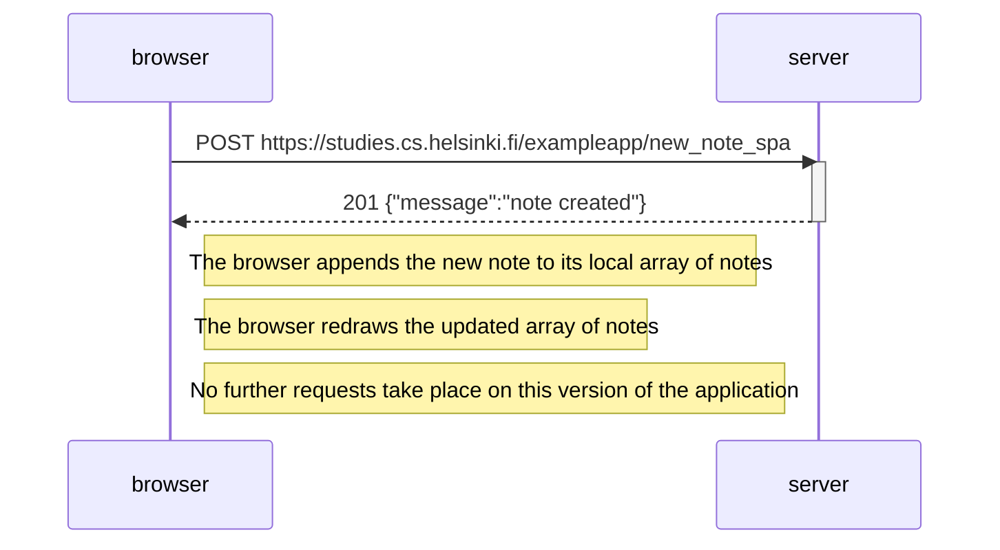

```mermaid
sequenceDiagram
    participant browser
    participant server

    browser->>server: POST https://studies.cs.helsinki.fi/exampleapp/new_note_spa
    activate server
    server-->>browser: 201 {"message":"note created"}
    deactivate server

    Note right of browser: The browser appends the new note to its local array of notes

    Note right of browser: The browser redraws the updated array of notes

    Note right of browser: No further requests take place on this version of the application
```
